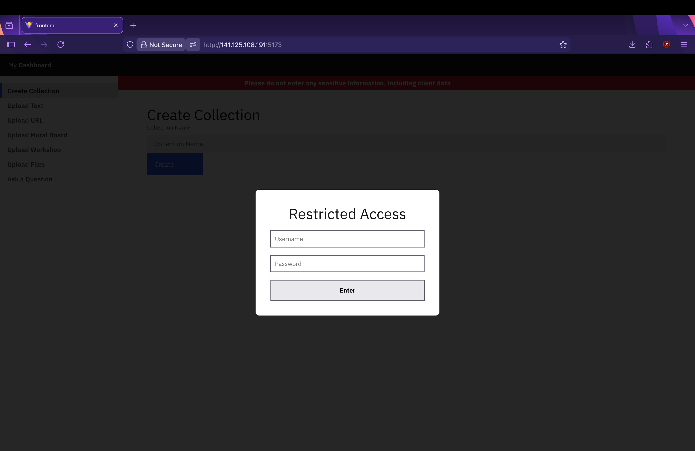
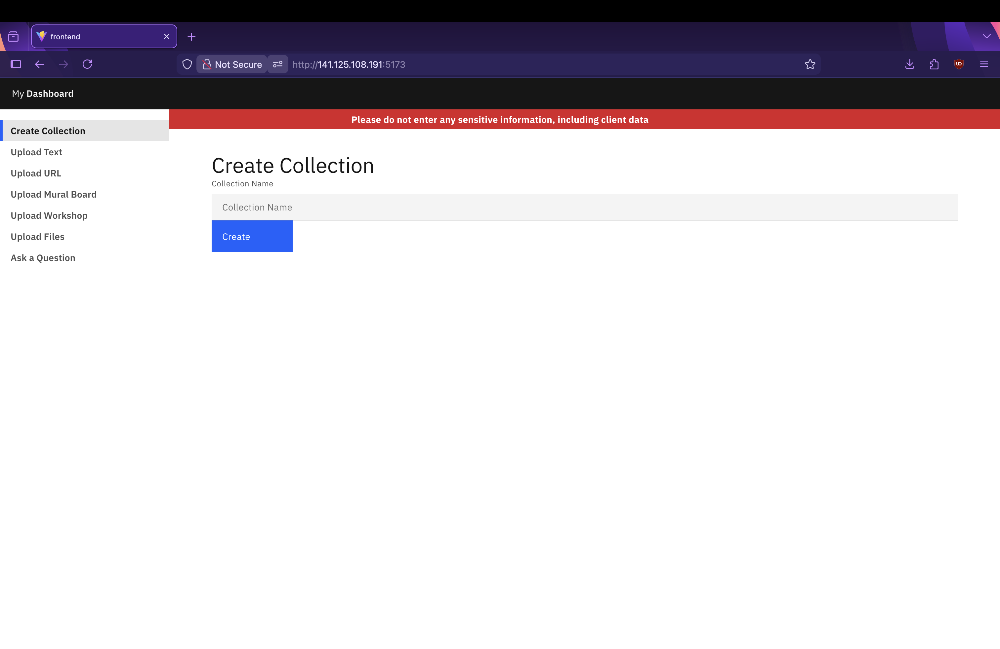
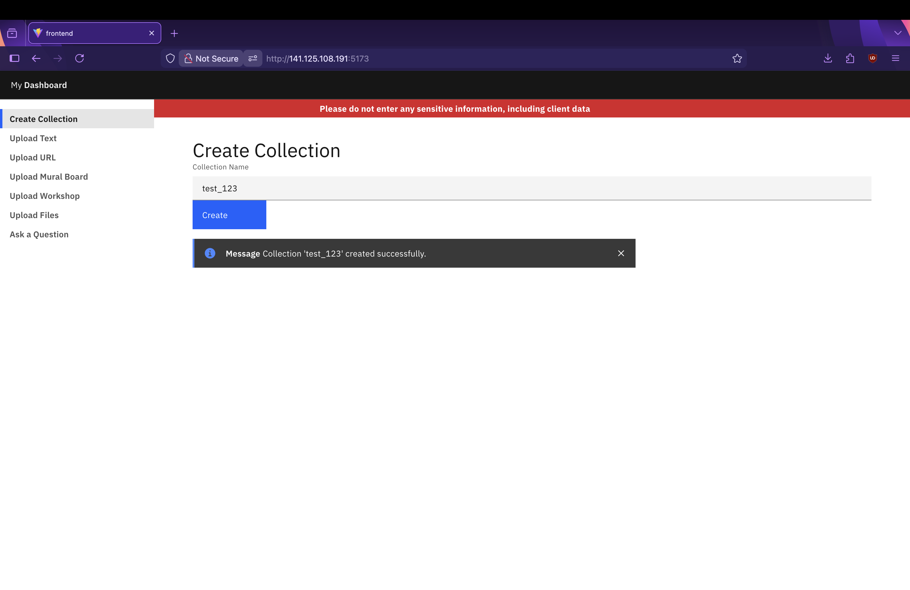
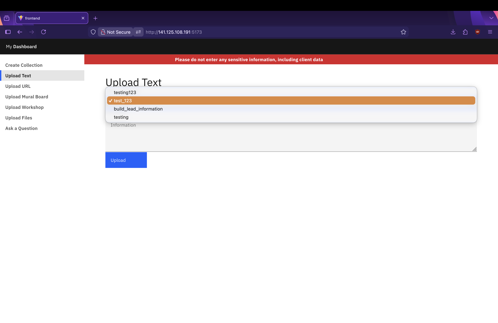
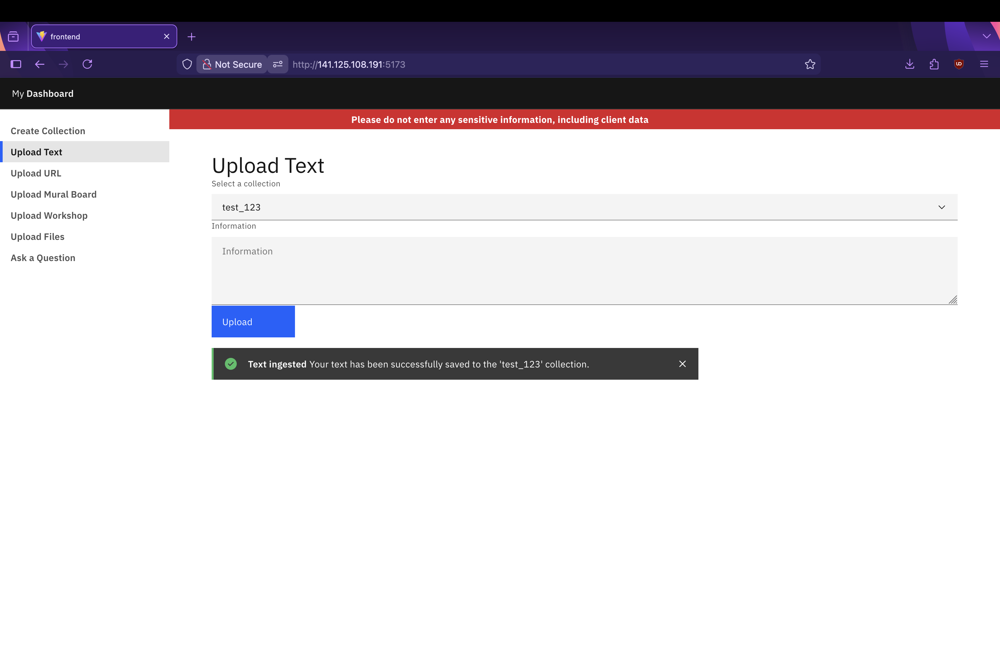
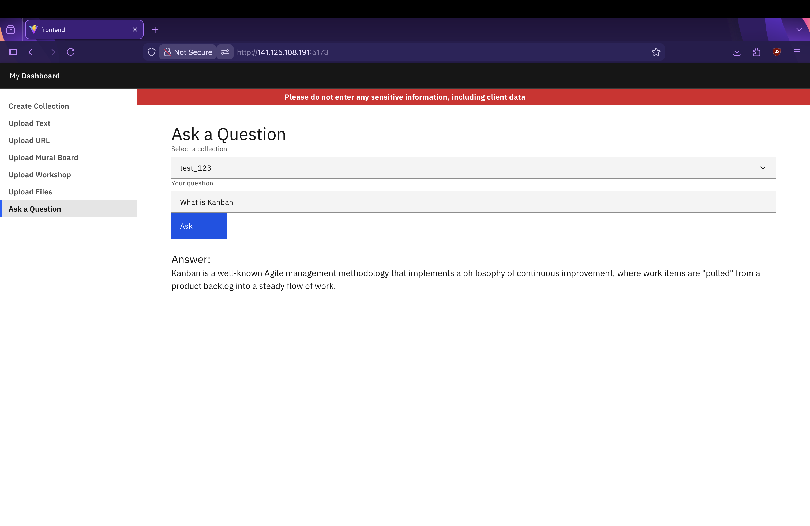
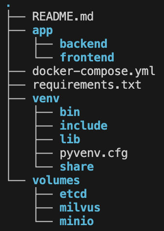
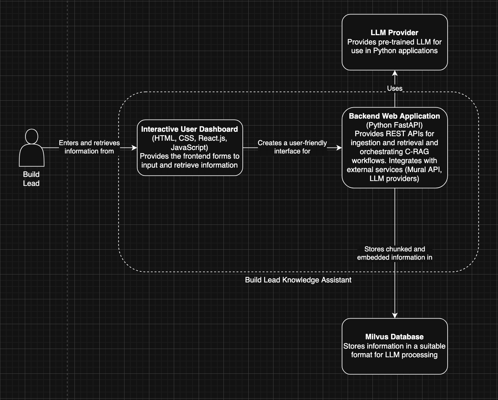
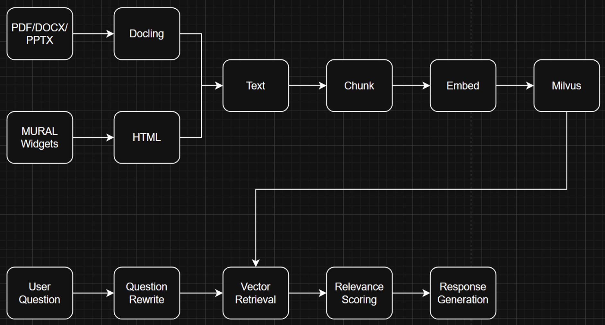

# Build Lead Assistant
*Created by **Sarah Robinson** as the final year synoptic project for BSc Digital Technology Solutions (Software Engineering) Degree Apprenticeship with IBM and the University of Exeter.*

The Build Lead Assistant was designed to support build leads in the Client Engineering proof-of-concept team by creating repositories of build lead knowledge and templates, as well as hosting shareable information for specific builds.

It allows users to ingest knowledge from multiple sources into collections, then query that knowledge using natural language, and finally provide answers sourced from the uploaded content generated by an LLM.

To learn more about using the application, see [User Guide](#user-guide). To learn about how it was built and the technologies that support it, navigate to [How it Works](#how-it-works). To provide feedback, suggestions, or ask questions, please [click here](https://forms.cloud.microsoft/r/ZYjqsNyXBQ) for the survery.

>I am also reachable via email: sarah.robinson@ibm.com for IBM, sr805@exeter.ac.uk for University of Exeter

## User Guide
> The following steps and screenshots were recreated using the Firefox browser.

The Build Lead Assistant is a web application accessible via a browser.

**Type the following into your URL:**

`http://141.125.108.191:5173/`
> In its current proof-of-concept state, the application uses the less secure http rather than https. Other precautions have been taken to mitigate the risks that come with this.

The following screen should appear:

**Enter credentials:**

Username: `app_user`
Password: `synopticproject?`

>If you want to use this application to understand about build lead processes, generate templates, and access information on projects and build leading, please skip straight to step 6.

This will take you to the homescreen, where you can create a collection.

 
**Enter your collection name in the text box and click create:**

> Collection names can only contain numbers, letters and underscores

You can now enter information into your collection from various sources:
* Text
* URL
* Mural board
* Workshop information
* Files (PDF, TXT, DOCX, PPTX)

**Use the sidebar to navigate to your chosen upload method:**

For all methods, make sure to chose the correct collection to upload information to.
 >Once information has been uploaded to a collection, it cannot be removed

**Enter the information via the user interface:**

* Text input could be used to enter FAQs, or copied text from unsupported files/webpages.
* Depending on the size of the webpage and internet speeds, URL upload may take some time - please be patient!
* When uploading a Mural board, you will be taken to an authentication page and may be asked to log in to your Mural account.
* When entering workshop information, you can enter a link to a Mural board as well as adding and removing attendees. This ensures users can accurately record who was at the event for future reference.
* Files currently supported are PDF, TXT, DOCX and PPTX.

Once sufficient information has been uploaded to your collection, navigate to the "Ask a Question" page using the sidebar.

**Select the collection you want to query, then type in a question:**

> The more information a collection contains, the more accurate and detailed an answer it will be able to provide.

If you are using the assistant to find resources and information on build leading, query the prepopulated `build_lead_information` collection.

## How it Works
This web application comprises of a Python FastAPI backend, a Vite/React frontend, and a Milvus vector database.

The structure of the build-lead-application file is as follows:

### Architecture
The build lead application is currently hosted on an IBM TechZone VSI running a RHEL9 environment. It uses microservices architecture, with five containers (backend, frontend, milvus-standalone, milvus-minio, milvus-etcd) deployed using podman, and orchestrated through a docker-compose file.

### AI Component

Building on the well known RAG (retrieval-augmented-generation) technology, this application uses Corrective-RAG to perform information retrieval and answer generation.

During ingestion, information is chunked, then embedded into the Milvus vector store database. When the user asks a question, the C-RAG pipeline is initiated:
1. **Question rewriting** – LLM reformulates the question for optimal retrieval
2. **Vector embedding** – Question is embedded using a local sentence-transformer model
3. **Semantic search** – Top 3 most relevant chunks retrieved from Milvus via cosine similarity
4. **Relevance grading** – LLM scores each chunk, discarding irrelevant ones
5. **Answer generation** – LLM generates an answer using verified relevant context

The additional feedback loop acts as a self correction mechanism that evaluates and refines the retrieved knowledge, reducing errors and improving accuracy.

